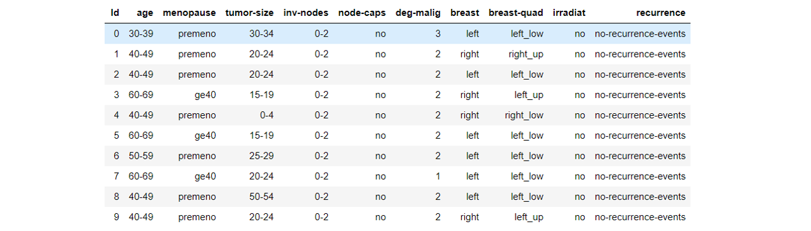

# Data fingerprinting

## Overview
A fingerprint is a personalised, secret piece of information identifying both the data owner and the recipient of the data. 
By embedding the fingerprint into the data, the owner achieves two main goals: 
1. **tracing of the unauthorised data redistributor**
2. **ownership verification**

The fingerprint system is a two-stage process: 


The main properties of the fingerprinting system include:
- security - without access to the secret key, the fingerprint detection process cannot be performed correctly
- blindness - the fingerprint extraction does not require access to the original data
- public system - the fingerprinting system assumes that the method used for embedding the mark is public. Defence only lies in the choice of the private parameters (owner's secret key)
- robustness - the fingerprint can not be removed via benign data updates and malicious attacks without rendering the data useless
- utility - the fingerprint introduces only minor, insignificant modifications to the data

## Similarity-based fingerprinting
Traditional fingerprinting methods [1,2] rely on pseudo-random modification of the data values and are originally designed for large numerical data, assuming a great embedding space. 
Their effectiveness falls short for real-life datasets with limited domains, which is usually case for categorical types, and they affect the semantic coherence with newly embedded random values [3]. 
Therefore, additional methods have been proposed that consider preserving statistical moments in the data, aiming to keep fingerprint robustness high in both single- and multi-attacker scenarios [4-6]. 
Similarity-based fingerprinting leverages (i) pseudo-random embedding pattern for secrecy and detectability of the fingerprint and (ii) neighbourhood search similar to kNN algorithm for preserving the data utility. 
Building upon an earlier non-blind approach [7] (see _blindness_ property above), the fingerprint is embedded by sampling the values from the existing distributions in the dataset, ensuring the high utility of the fingerprinted data while keeping the robustness of the fingerprint.

A fingerprint is an _L_-bit sequence where each bit determines how the new value will be sampled at a pseudo-random position in the dataset. For each selected data value, there is a 50% chance the new value will be sampled from a low-density area of the value distribution in similar records and a 50% chance to be sampled from a high-density area of the value distribution in similar records. 
For example, below we show how a value distribution in similar records (the _neighbourhood_) might look like for a chosen data value. If the marking bit is 0 as depicted below, the new marked value is sampled from the low-density area (e.g. below 75th percentile). 


During the fingerprint detection, this process is reversed to decode the embedded bit. Hence, if the value falls in the low-density area, the embedded bit is assumed to be 0, otherwise 1. These extracted bit assumptions are added to the voting system. Each of the _L_ fingerprint bit gets assigned votes for the bit being 0 or 1. For _L_=16, the final voting might look like this:


The upper row represents the votes for bit 0 per bit-position, and the lower row represents the votes for bit 1 per bit-position. According to the majority vote, the fingerprint is decided to be the 16-bit sequence: 0100000001100100 which in a correct setup is the exact sequence associated to the recipient of the data copy. In reality, the fingerprint sequences are much longer (>100-bit) to ensure a small mutual overlap.

### Demo example: 
Let's assume we want to fingerprint the fragment of [Breast Cancer dataset](https://archive.ics.uci.edu/dataset/14/breast+cancer).


The fingerprint we want to embed is _1110 0001 0011 1100_ (see: Fingerprint generation).

In each iteration (for each record), a pseudo-random number generator (PRNG) decides on the following:
- **IF** the records will be marked
- **WHERE** in the record should the mark be
- **WHICH** fingerprint bit shall be embedded
- **HOW** the fingerprint bit shall be embedded


To select the new value, we look at similar records and the distribution of the target attribute in those records. For the target values, we construct a frequency list (categorical) or probability density function (ratio attributes).
Based on the mark bit, we have two possible outcomes, either to sample from low-frequency area (mark bit=0) or high-frequency are (mark bit=1). In this case, the mark bit is 1 so we sample from high-frequency area, i.e. choose the most frequent value.


The marked record then looks like this (Although it preserves the original value, the bit is embedded. More often, the marked value will actually change):


The detection algorithm works in reverse; we show the same iteration (for the same record) of the detection algorithm.


To extract the value of the fingerprint bit, we look where in the frequency plot the target value falls. If it is the most frequent value, like in this case, then the mark bit must have been 1. Otherwise, it would have been detected as 0.
Then, to revert the _mark_ bit into the fingerprint bit, we xor it with the mask bit (like we did in the insertion) - in this iteration mask bit=1, and finally obtain 0 as the fingerprint bit.
We then update the vote that the fingerprint bit at position 3 is 0 and continue extracting from other records:


The final fingerprint will be the majority vote over all fingerprint bits. Here is an example of the voting progression through the detection (note that sometimes errors can be made):
 

## Fingerprint generation
The input to the insertion (embedding) algorithm is a fingerprint: a bit sequence that encodes the owner's secret key and the recipient's ID. To create such a sequence, we need to make sure that (i) each recipient gets a unique fingerprint such that a unique recipient's ID can be recovered from the fingerprint and (ii) the sequence is secret. However, one additional requirement is key to resistance against collusion attacks (see: Vulnerabilities). The fingerprint should be designed such that it is possible to infer with some confidence if there was a collusion and which recipients colluded. We call these _collusion-resistant codes_.
Below is a summary of some fingerprint types:


## Virtual record UID
The PRNG-based methods, like this one, depend on the record UID to find the locations for marks and marks themselves. The records' UIDs might be crucial for the data table, so they are not always easily removable. However, they can still be prone to manipulation. In this case, the UIDs can be extracted from the record itself by e.g. combining a few attribute values into a representative, unique ID of the record.

## Vulnerabilities
Fingerprints can be subject to malicious manipulations or benign updates of the dataset, in which case they should retain high robustness. 
There are two main threat scenarios for fingerprinting:
1. Single-user attacks: the attacker is a data recipient who only has access to one (their own) data copy. In that case, they might modify data values, remove records, modify record UIDs, modify whole attributes etc., while trying to preserve the utility of the data (assumed downstream task, data statistics, etc.).
2. Collusion attacks: the attackers are data recipients who decide to collaboratively remove the fingerprint. This usually relies on observing differences among data copies and modifying the diverging values by, e.g. averaging them, substituting with new values, etc.

## Getting started 
### Installation
You can use the fingerprinting tool by cloning this repository:
```
$ git clone https://github.com/sbaresearch/data-fingerprinting.git
```
Install dependencies:
```
pip install -r requirements.txt
```

### Fingerprint embedding
Run ```embedding.py``` with arguments specifying:
- data file
- secret key (used also to correctly detect the fingerprint)
- user's ID

Optional arguments include fingerprint parameters such as gamma (a probability of marking a single record is 1/gamma), fingerprint length, output file, log file and config file where some additional parameters can be specified.

For example, the command:
```
python embedding.py speml/Financial_Records_Demo.csv 177264 10 
```
will run the embedding on the dataset speml/Financial_Records_Demo.csv with (your) secret key 177264 for the recipient with the ID=10 (for simplicity, we keep the user IDs as sequential integers).
It will also read the example config file ```speml/config.json```. The embedding might take a few minutes.

The fingerprinted data is by default written in ```speml/fingerprinted_output.csv``` in the root directory (this can be changed by specifying argument ```--out [another_dest].csv```).

The script will also output a ```speml/log.json``` file consisting of the summary of used parameters. These exact parameters need to be used in the detection process for the correct fingerprint extraction (along with the correct secret key).

### Fingerprint detection
Run ```detection.py``` with arguments specifying:
- data file
- secret key (only the correct secret key will lead to successful detection)

Optional arguments include fingerprint parameters such as gamma, fingerprint length, output file, log file and config file where some additional parameters can be specified.
Note that you _need_ to use the same parameters as in the embedding.

Continuing from the embedding example, the command:
```
python detection.py speml/fingerprinted_output.csv 177264  
```
will run the detection algorithm on ```speml/fingerprinted_output.csv``` file with your secret key 1177264. 
The expected output is the ID of the user (in this case, 10) and detection confidence (1.0 for a perfect match).

_Troubleshooting:_ If the detection fails in a seemingly normal scenario, it might be due to a couple of preventable reasons. 
Firstly, the passed arguments and fingerprint parameters need to match exactly, so double-check the passed arguments and config file. 
Secondly, sometimes the choice of parameters (mainly gamma and fingerprint length) is not robust enough for given dataset; the rule of thumb is to ensure #data_records/(gamma*fp_len)>20.
If you run into other issues, feel free to contact us.

## References: 
[1] Li, Y., Swarup, V. and Jajodia, S., 2005. Fingerprinting relational databases: Schemes and specialties. IEEE Transactions on Dependable and Secure Computing, 2(1), pp.34-45.\
[2] Al Solami, E., Kamran, M., Saeed Alkatheiri, M., Rafiq, F. and Alghamdi, A.S., 2020. Fingerprinting of relational databases for stopping the data theft. Electronics, 9(7), p.1093.\
[3] Šarčević, T. and Mayer, R., 2019. An evaluation on robustness and utility of fingerprinting schemes. In Machine Learning and Knowledge Extraction: Third IFIP TC 5, TC 12, WG 8.4, WG 8.9, WG 12.9 International Cross-Domain Conference, CD-MAKE 2019, Canterbury, UK, August 26–29, 2019, Proceedings 3 (pp. 209-228). Springer International Publishing.\
[4] Yilmaz, E. and Ayday, E., 2020. Collusion-resilient probabilistic fingerprinting scheme for correlated data. arXiv preprint arXiv:2001.09555.\
[5] Kieseberg, P., Schrittwieser, S., Mulazzani, M., Echizen, I. and Weippl, E., 2014. An algorithm for collusion-resistant anonymization and fingerprinting of sensitive microdata. Electronic Markets, 24, pp.113-124.\
[6] Ji, T., Ayday, E., Yilmaz, E. and Li, P., 2022. Towards robust fingerprinting of relational databases by mitigating correlation attacks. IEEE transactions on dependable and secure computing, 20(4), pp.2939-2953.\
[7] Sarcevic, T. and Mayer, R., 2020. A correlation-preserving fingerprinting technique for categorical data in relational databases. In ICT Systems Security and Privacy Protection: 35th IFIP TC 11 International Conference, SEC 2020, Maribor, Slovenia, September 21–23, 2020, Proceedings 35 (pp. 401-415). Springer International Publishing.\
